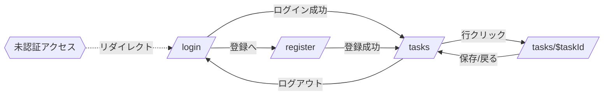

# 機能仕様書

画面ごとの機能詳細・画面遷移・UI/UX 方針を定義する。機能要件の一覧は [`02-requirements-specification.md`](./02-requirements-specification.md) を参照。

## 目次

- [画面仕様](#画面仕様)
- [画面遷移](#画面遷移)
- [UI/UX 方針](#uiux-方針)

## 画面仕様

想定する画面（ルート）一覧。各画面の表示項目・操作の詳細は実装着手時に追記する。

| ルート | 画面 | 認証 | 主な TanStack |
|--------|------|------|---------------|
| `/login` | ログイン | 不要 | Form |
| `/register` | ユーザー登録 | 不要 | Form |
| `/tasks` | タスク一覧（仮想化テーブル） | 必須 | Router(loader) / Query / Table / Virtual |
| `/tasks/$taskId` | タスク詳細・編集 | 必須 | Router / Query / Form |

### タスク一覧（`/tasks`）

<!-- 記入: 列構成（タイトル/ステータス/優先度/期限/操作）・ソート/フィルタ UI・新規作成導線・仮想スクロール領域のレイアウト -->

### タスク詳細・編集（`/tasks/$taskId`）

<!-- 記入: 編集フォームの項目・保存/削除ボタン・バリデーション表示 -->

## 画面遷移

## UI/UX 方針

### 全体方針

- **スタイリング: TailwindCSS**（ユーティリティCSS / JIT）を採用する。
- 重視する体験は「大量タスク一覧の見やすさ・操作性」。仮想スクロール領域とソート/フィルタ UI の操作性を優先する。

- **UI 部品ライブラリは採用しない（Tailwind 単体）**。TanStack Table / Virtual はヘッドレス（ロジックのみ提供）で、テーブルのマークアップは自前で組むため、コンポーネントライブラリの出番がない。素で組むことが本プロジェクトの学習目的に合致する。
  - モーダル/ドロップダウン等は native 要素（`<dialog>` / `<select>`）+ Tailwind で対応する。
  - 将来どうしてもアクセシブルな部品を自作したくない場面が出たら、その部品だけ Radix Primitives を à la carte で追加する（shadcn/ui のような一式導入はしない）。

<!-- 記入: 重視する体験（対応デバイス・レスポンシブ方針）・ビジュアルトーン・タイポグラフィ・アニメーション方針を追記 -->
