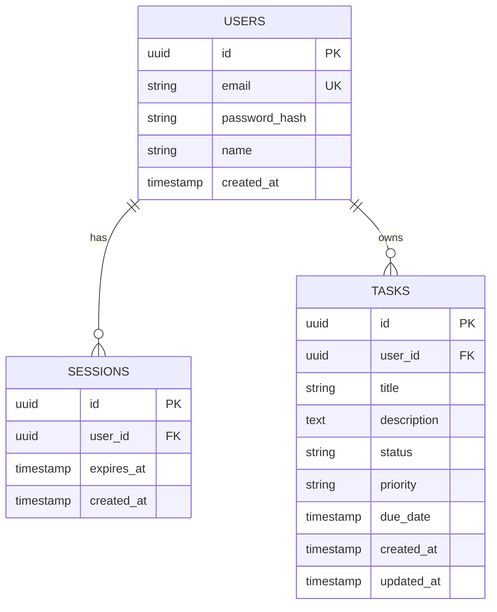
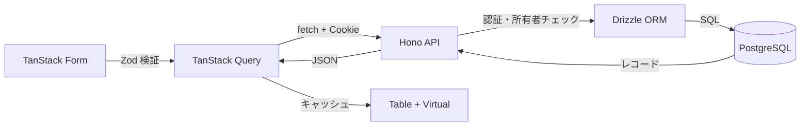

# データ仕様書

データモデルとスキーマを定義する。API のレスポンス形式は [`07-api-specification.md`](./07-api-specification.md) を参照。スキーマは Drizzle ORM（PostgreSQL）で定義し、`packages/db` に集約する。

## 目次

- [エンティティ一覧](#エンティティ一覧)
- [ER 図](#er-図)
- [エンティティ詳細](#エンティティ詳細)
- [スキーマ定義](#スキーマ定義)
- [データフロー](#データフロー)

## エンティティ一覧

| エンティティ | 説明 |
|------|------|
| users | 登録ユーザー |
| sessions | ログインセッション（HttpOnly Cookie に対応） |
| tasks | ユーザーが所有するタスク |

## ER 図

## エンティティ詳細

### users

#### フィールド

| フィールド | 型 | 必須 | 説明 |
|-----------|----|------|------|
| id | uuid | ✓ | 主キー |
| email | varchar(255) | ✓ | ログイン ID。一意 |
| password_hash | varchar | ✓ | ハッシュ化済みパスワード（平文は保存しない） |
| name | varchar(50) | ✓ | 表示名 |
| created_at | timestamptz | ✓ | 作成日時 |

#### インデックス・制約

- `email` に一意制約 + インデックス。

### sessions

#### フィールド

| フィールド | 型 | 必須 | 説明 |
|-----------|----|------|------|
| id | uuid | ✓ | セッション ID（Cookie 値の元） |
| user_id | uuid | ✓ | 所有ユーザー（FK → users.id, ON DELETE CASCADE） |
| expires_at | timestamptz | ✓ | 有効期限 |
| created_at | timestamptz | ✓ | 作成日時 |

#### インデックス・制約

- `user_id` にインデックス。期限切れセッションは定期的に削除する。

### tasks

#### フィールド

| フィールド | 型 | 必須 | 説明 |
|-----------|----|------|------|
| id | uuid | ✓ | 主キー |
| user_id | uuid | ✓ | 所有ユーザー（FK → users.id, ON DELETE CASCADE） |
| title | varchar(120) | ✓ | タイトル |
| description | text | - | 説明（最大 2000 文字） |
| status | varchar | ✓ | `todo` / `in_progress` / `done` |
| priority | varchar | ✓ | `low` / `medium` / `high` |
| due_date | timestamptz | - | 期限 |
| created_at | timestamptz | ✓ | 作成日時 |
| updated_at | timestamptz | ✓ | 更新日時 |

#### インデックス・制約

- `user_id` にインデックス（一覧取得・所有者スコープの絞り込み）。
- `(user_id, status)` / `(user_id, priority)` の複合インデックスを検討（ソート・フィルタ用）。
- `status` / `priority` は Postgres の enum もしくはアプリ側 Zod で値域を制御。

## スキーマ定義

- Drizzle スキーマを `packages/db/src/schema.ts` に定義し、`drizzle-kit` でマイグレーションを生成・適用する。
- Drizzle が推論する型を `packages/shared` 経由で front/api に共有し、Zod スキーマと整合させる。
- TanStack Virtual の検証用に、シードスクリプトで 1 ユーザーあたり数千件のタスクを投入する。

<!-- 記入: 実際の schema.ts / マイグレーション手順が固まったらコマンドを追記 -->

## データフロー

