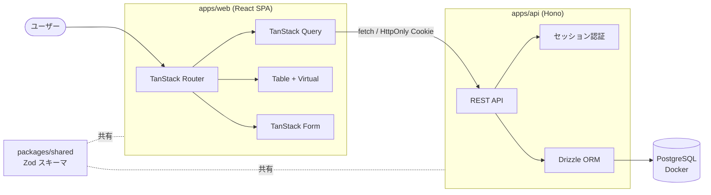

# アーキテクチャ仕様書

システム構成・技術スタック・インフラ・セットアップ手順を定義する。

## 目次

- [技術スタック](#技術スタック)
- [構成方針](#構成方針)
- [システム構成図](#システム構成図)
- [環境変数](#環境変数)
- [ローカル開発セットアップ](#ローカル開発セットアップ)
- [デプロイ](#デプロイ)
- [将来構成](#将来構成)

## 技術スタック

本プロジェクトは **TanStack 5本柱（Router / Query / Table / Virtual / Form）** を実アプリで試すことを目的とする。各技術はその学習目的から選定している。

| レイヤー | 技術 | 備考 |
|----------|------|------|
| フロント | React + Vite + TypeScript | SPA |
| ルーティング | **TanStack Router** | 型安全ルーティング・`beforeLoad` 認証ガード・loader プリフェッチ |
| データ取得 | **TanStack Query** | キャッシュ・楽観的更新・invalidation |
| 一覧表示 | **TanStack Table** + **TanStack Virtual** | ソート/フィルタ + 大量行の仮想スクロール |
| フォーム | **TanStack Form** + Zod | ログイン/登録/タスク編集フォーム |
| スタイリング | **TailwindCSS** | ユーティリティCSS（JIT） |
| テスト | **Vitest** / **Playwright** | ユニット（Vitest）/ E2E（Playwright） |
| API | **Hono**（Node ランタイム） | 軽量 REST API |
| ORM | **Drizzle ORM** | PostgreSQL 接続・マイグレーション（drizzle-kit） |
| DB | **PostgreSQL**（Docker コンテナ） | docker compose で起動 |
| 認証 | セッション Cookie（HttpOnly） | 詳細は [`06-security-specification.md`](./06-security-specification.md) |
| バリデーション | Zod | front/api で共有スキーマ |
| モノレポ | pnpm workspaces + Turborepo | キャッシュ付きタスクランナー |

## 構成方針

モノレポ（pnpm workspaces + Turborepo）。Zod スキーマと Drizzle 由来の型を共有パッケージに集約し、DB → API → フォームまで型を一気通貫させる。

```
.
├── apps/
│   ├── web/          # React + Vite + TanStack（Router/Query/Table/Virtual/Form）
│   └── api/          # Hono + Drizzle（REST API・認証）
├── packages/
│   ├── db/           # Drizzle スキーマ・マイグレーション・DB クライアント
│   ├── shared/       # Zod スキーマ・共有型（front/api 双方が参照）
│   └── config/       # 共有 tsconfig / eslint 設定
├── docker-compose.yml # PostgreSQL コンテナ
├── turbo.json
└── pnpm-workspace.yaml
```

<!-- 記入: 上記から変更する場合は実構成に合わせて更新する -->

## システム構成図



## 環境変数

秘匿情報はクライアント（apps/web）へ露出しない。`VITE_` プレフィックス付きのみがフロントに渡る点に注意。

| 変数 | 用途 | 参照箇所 |
|------|------|----------|
| `DATABASE_URL` | PostgreSQL 接続文字列 | apps/api, packages/db |
| `SESSION_SECRET` | セッション署名用シークレット | apps/api |
| `SESSION_TTL` | セッション有効期限 | apps/api |
| `VITE_API_BASE_URL` | API のベース URL | apps/web |
| `CORS_ORIGIN` | 許可するフロントのオリジン | apps/api |

<!-- 記入: .env.example を用意し、追加した変数はここに追記する -->

## ローカル開発セットアップ

<!-- 記入: 実際のコマンドが固まり次第更新。以下は想定フロー -->

1. 前提: Node.js（LTS）, pnpm, Docker
2. `pnpm install`
3. `cp .env.example .env` で環境変数を設定
4. `docker compose up -d`（PostgreSQL 起動）
5. `pnpm db:migrate`（Drizzle マイグレーション適用）
6. `pnpm db:seed`（大量タスク投入 ※ TanStack Virtual 検証用に数千件）
7. `pnpm dev`（web / api を Turborepo で並行起動）
8. `pnpm test`

## デプロイ

<!-- 記入: 学習用途のため未定。デプロイ先・トリガー（ブランチ）・ビルド手順を確定したら記載 -->

## 将来構成

<!-- 記入: TanStack Start への移行検証・E2E 環境追加など、拡張候補があれば -->
